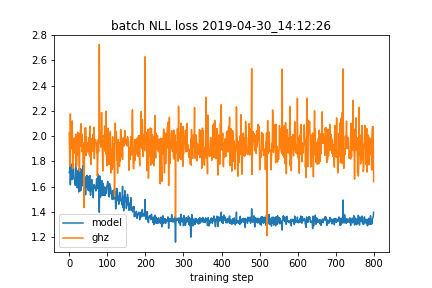

#Notes

# April 22
Current status: training of (complex-valued) MPS on single-basis data using local updates precedes very smoothly indeed. On the L=4 dataset, without hyperparam fine-tuning I get better results than I'd managed to acheive with global, non-adaptive updates.

However, training so far has not succeeded on data sets including multiple bases. I think there are two primary suspects:
    - My implementation of the unitaries is either wrong, or not consistent with conventions used in generating the datasets.
    - All the implementations are OK, it's just the optimization procedure itself that needs to be improved. 

The former seems more likely.

Update: just found at least one major flaw in the computation of amplitudes: the difference between basis state index and eigenvalue of the number operator. Under standard basis ordering conventions, where the most highly excited states comes first, these are opposites: (n eigenvalue) = 1 - (basis state index). My code for computing amplitudes and gradients was not taking this into account. 

That can be fixed simply by preprocessing the measurement outcomes:
indices = (1 - outcomes)/2
and feeding indices the MPS training. This doesn't affect the quality of training itself.

During training on rotated-basis sets, I find that the cost function starts increasing after an initial decrease. What I ought to do is train on a really simple set, like a two-qubit product state. 

Implementation of unitaries in pauli_exp seems to be OK.

### Meeting with Manuel and Evert
One thing to check: can random-unitary measurements be used to obtain fidelities between two density matrices? Ie Tr(rho1 rho2), where rho1 is an experimental state and rho2 is a reconstruction. 

Another mixed state ansatz: MPS with some sites traced out. 

To try: 
    - 
    - pure state MPS "just try it"
        - first, for globally pure states
        - then, add a bit of Lindblad
            - "how far away are we in local density matrices"
        - then, how to make nonpure ansatzes?
            - 
        - can you get (bounds on) reconstruction fidelity using rotated bases? 

### update: I'm a dumbass
The contract_interval() method wasn't including local rotations. fixed.
Also in grad_twosite_logprob()

Having fixed typos in models.py, it seems that the gradient-computation under local rotations works OK. I think my current difficulties in training stem from entropy of the measurement-outcome distribution for small datasets. Consider:
    - Training on z-product state, 100 samples in z basis only -> no problem
    - Training on x-product state, 100 samples in x basis only -> no problem
    - Training on z-product state, 100 samples in x basis only -> poor training
    - Training on x-product state, 100 samples in z basis only -> poor training.

Aha! And indeed, if I now switch back to the larger datasets, training on informationally complete basis sets, training seems to work very well indeed.

### A few practical notes.
    - So far, still haven't trained well on GHZ states (have only tried discrete bases here)
        - Using a smaller SV cutoff leads to better results, but not great
        - Random-basis training on GHZ states does lead to some learning, but it's very poor. Need to go to an easier case first (eg product states in random bases)
            - haven't yet implemented entropy penalty during training.

## April 29

### Status:
    * Have demonstrated successful discrete, multi-basis training on product states in the z basis.
    * Updated models.py to include two-site SGD update. In the process I may have fixed some bug in the original SGD update code, because I can now train on multi-discrete-basis GHZ data to get MPSs with the correct probabilities in the z-basis. 
    * **However**, the relative phase between the two basis states is incorrect: out of phase by 75 degrees (should be zero).
        * This success seems to be precarious / initialization-dependent: on a second training run the ghz probabilities come out at .4 each, with the angle still far from zero. I guess the training is getting stuck in local minima. Right now I'm using vanilla SGD, and no entropy regularization. Might be cool to try adding the regularization next.
        * Seems that the final angle varies strongly between training attempts -- indicating perhaps that it's not well-constrained by the data?

I've now added s2 penalty. All the training code seems to be bug-free; can perform random-basis training on z-product states.

With 1e4 samples, training on L=2 ghz state, I find some learning, but the probabilities of the trained state for the various z-basis states are poorer than discrete-multibasis. OTOH, it seems to get the angle right more often.

Large batch sizes seem to be preferable.

Sometimes the angle converges to zero, and sometimes it converges to 180 degrees. This is actually really interesting -- I think this may be fundamental to the random-basis NLL training method. In particular, I do seem to obtain a robust convergence in the cost function in each case -- I think it's possible that, for a given dataset, two states with different phases may have very similar NLL average cost functions, corresponding to e.g. two nearly equal minima.

## April 30
### Status
Random-basis code works, but training quality is poor. 
The current algorithm is very simple: for each batch of data, sweep left and then right across the chain. 
At each bond, merge, gradient-step, and then break using that same batch. The gradient update is vanilla SGD; there's also a penalty added to the Renyi-2 entropy cost function, which I haven't found to have much effect so far. 

The really odd thing is, I get poor training even on an L=2 GHZ state, where there's only one bond (ie where the updates are effectively global!).

### Update: 
Here's something very interesting:

Here, I'm plotting the NLL cost function during random-basis training for the mps model (blue curve), and an exact ghz-plus MPS (orange). The true ghz state has a **significantly higher** cost on the training set! 

This suggests that the **sampling process is in error somehow**. Dataset used for this plot: test_datasets/settings_ghz_plus_random_basis_L=2.npy

Ah. Just found a bug in the qtools code that produces unitaries from angles -- I think one of the phi signs is wrong. will test in new branch.

Fixed, that seems to have done the trick! Can now train on 2-qubit ghz without hassle.

## May 6th
Some important recent updates:
* Added cached amplitudes in training (not much improvement)
* Added eigenvalue computation for reduced density ops
* Fixed bugs in NLL and S2 penalty gradient (both were missing normalization terms...)
* Qualitative understanding of the 'bond dimension inflation' I'd observed in training on GHZ states

Regarding the latter -- it seems the fundamental cause of large bond dims was a **large learning rate** during training. The reason is simple: the eigenvalue truncation happens just after the site tensor is updated according to the gradient. If the lr is large, this update produces a new twosite blob which seems generically to create entanglement. 

During gradient-descent training without S2 regularization, one often finds that entropy of the half-chain state peaks at a large spurious value before starting to fall down. 

## May 29
Another note on bond dimensions: I tried implementing the 'shaking' scheme that Jun recommended. I didn't find any improvement in final bond dimension as a result: as cutoff was swept up and down, the bond dimension would track it, increasing and decreasing; however, when the cutoff was lowered to its final value, the bond dim would shoot back up again.

the best method I've found so far is to hold the cutoff to be very loose for the first few epochs of training, then slowly pull it down to the specified value. The lr should also be kept small (<~ 1e-3 in the tests I've performed).